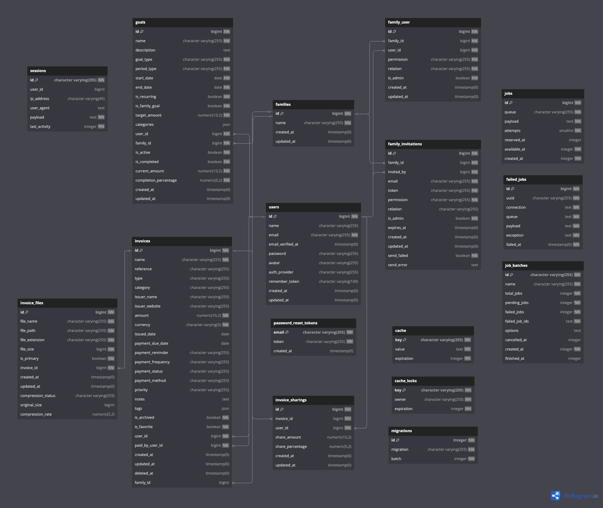

# Family Nest

## Introduction
Dans un monde de plus en plus digitalisé, la gestion des finances personnelles reste une préoccupation majeure pour beaucoup de familles.
Des factures s’accumulent et elles deviennent souvent difficiles à suivre ou à organiser de manière efficace.
Parfois, on les reçoit par mail, parfois par papier ou alors par message, ce dernier est de plus en plus courant pour les magasins.
Face à ce constat, l’idée de développer une application dédiée à la gestion des factures familiales devient une solution pratique et utile à mon sens.
Cette application permettrait aux familles de réunir leurs factures en un seul endroit, de les organiser de façon intuitive et de mieux comprendre leurs dépenses mensuelles.
Cela permettrait également de mieux gérer les imprévus financiers, qui sont loin d'être agréables.

## Temps passé sur le projet

Développement :

## Structure de la base de données

